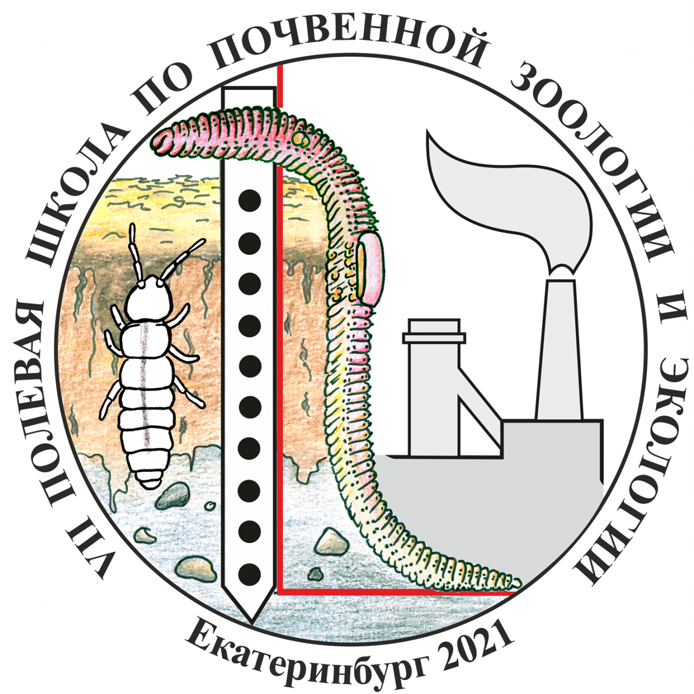

# VII полевая школа по почвенной зоологии и экологии

Материалы для мастер-класса по анализу данных метабаркодинга: 
https://vmikk.github.io/Soil_Zoology_2021/

Актуальное расписание [доступно по ссылке](https://docs.google.com/document/d/1tdnNAR2G9aMjTQXiOk18Eh3pG5jM3XibUInRXRu96CE/edit#heading=h.cqwqpdu04qfl)

 

(13 - 17 сентября 2021, ИЭРиЖ УрО РАН, Екатеринбург) 
[https://ipae.uran.ru/Soil_Zoology_2021](https://ipae.uran.ru/Soil_Zoology_2021)
