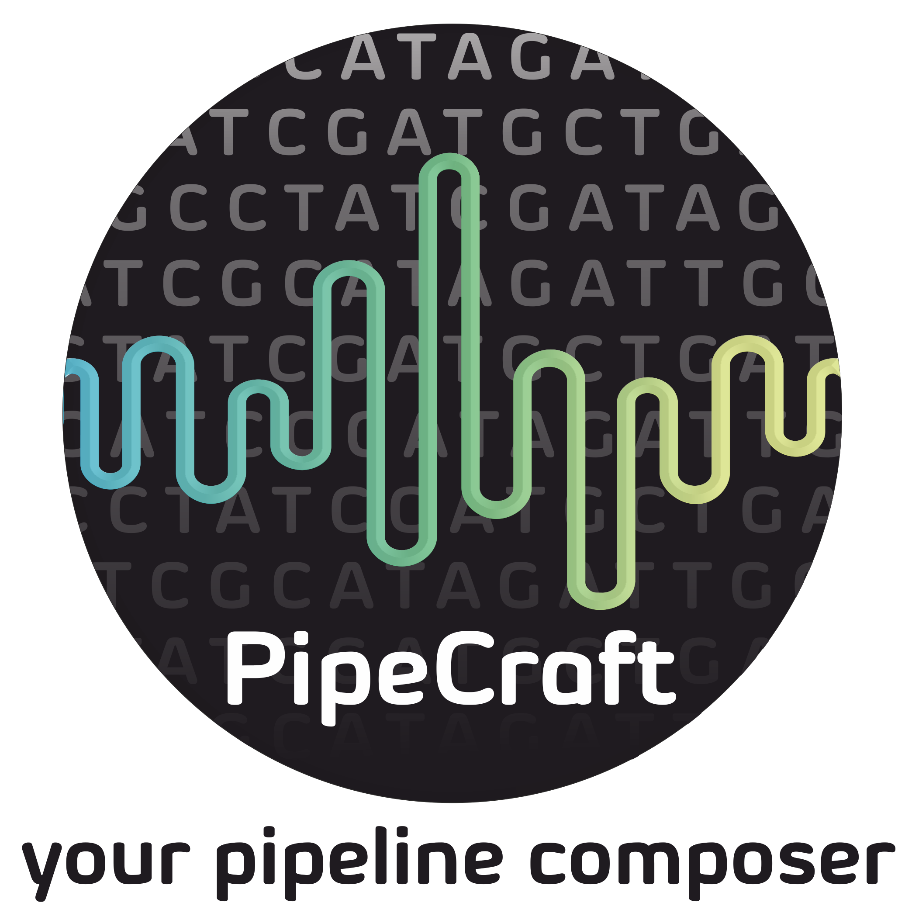
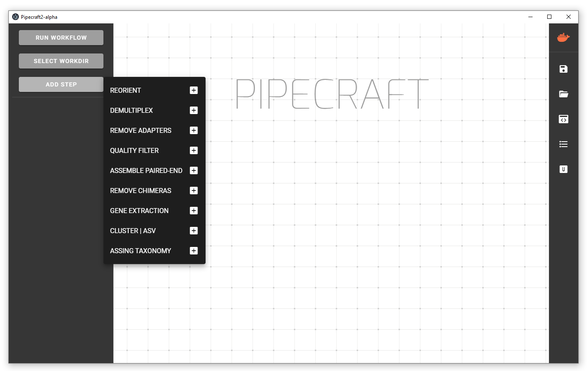
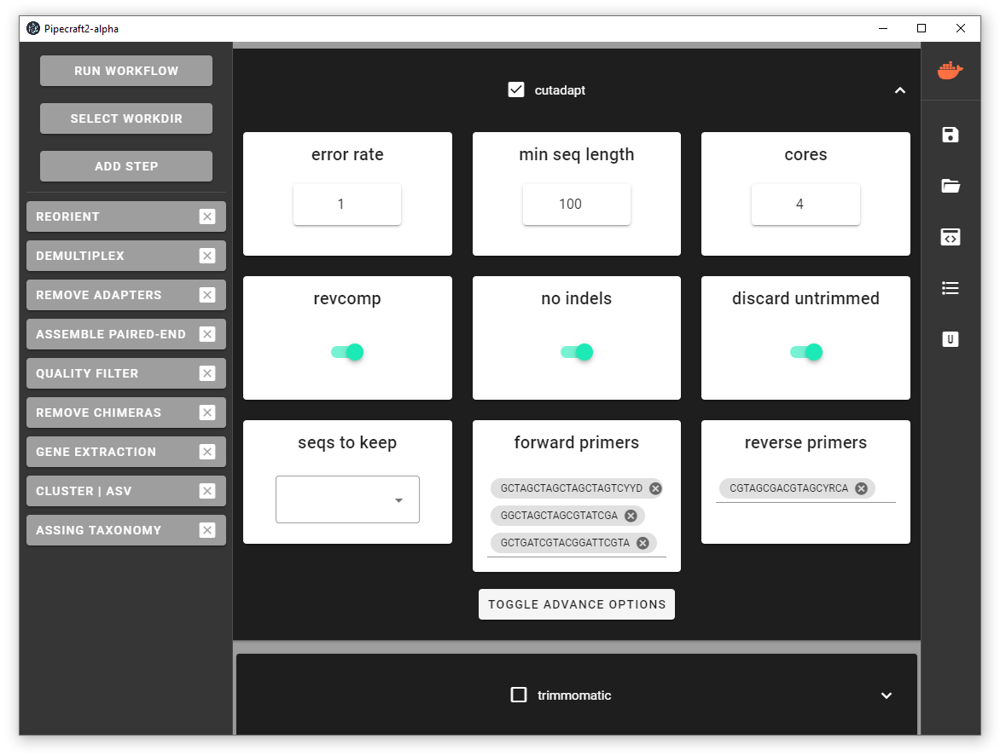

## PipeCraft2 (альфа-версия).

 

PipeCraft2 - кросс-платформенный конструктор пайплайнов для анализа данных метабаркодинга.  
Поддерживаемые данные: платформы Illumina, MGI-Seq, PacBio.  
GitHub репозиторий: https://github.com/SuvalineVana/pipecraft-vue  

Програма находится пока в активной разработке.

## Особенности и функции 

- Конструктор пайплайна 
   

- Настройка модулей (на примере программы `cutadapt` для удаления праймеров) 
   

- Импорт и экспорт нстроек 
   

## Установка

### Docker Desktop
https://desktop.docker.com/win/stable/amd64/Docker%20Desktop%20Installer.exe

### PipeCraft2 alpha
https://drive.google.com/file/d/1_yyENw6F-yjQ-4DEFSe_kESUBpYarJM_/view

## Ссылки

- Anslan S, Bahram M, Hiiesalu I, Tedersoo L. **PipeCraft**: Flexible open-source toolkit for bioinformatics analysis of custom high-throughput amplicon sequencing data // _Molecular Ecology Resources_ 17 (2017). [DOI:10.1111/1755-0998.12692](https://onlinelibrary.wiley.com/doi/10.1111/1755-0998.12692)

_________________

Примеры анализа данных с использованием:
- [USEARCH](01_USEARCH.md)
- [DADA2](02_DADA2.md)
