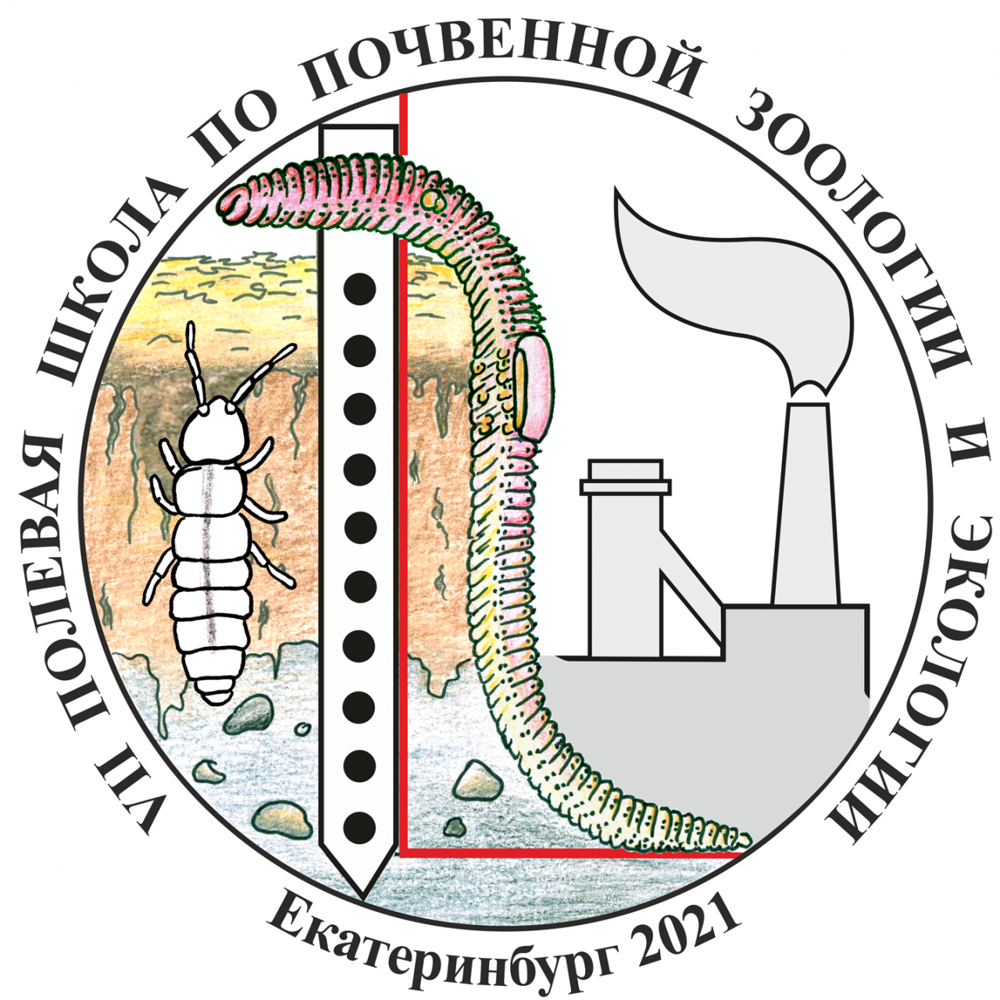

## Материалы для мастер-класса по анализу данных метабаркодинга 

 
(13 - 17 сентября 2021, ИЭРиЖ УрО РАН, Екатеринбург) 
[https://ipae.uran.ru/Soil_Zoology_2021](https://ipae.uran.ru/Soil_Zoology_2021)

## Содержание

1. [Установка необходимого ПО](00_Setup.md)
2. [Анализ с использованием USEARCH](01_USEARCH.md)
3. [Анализ с использованием DADA2](02_DADA2.md)
4. [Анализ с использованием PipeCraft2](03_PipeCraft2.md)

## Рекомендованная литература

- Семёнов МВ. Метабаркодинг и метагеномика в почвенно-экологических исследованиях: Успехи, проблемы и возможности // _Журнал общей биологии_ 80-6 (2019). [DOI:10.1134/S004445961906006X](https://elibrary.ru/item.asp?id=41241983)

- Шеховцов СВ, Шеховцова ИН, Пельтек СЕ. ДНК-штрихкодирование: методы и подходы // _Успехи современной биологии_ 139-3 (2019). [DOI: 10.1134/S0042132419030074](https://sciencejournals.ru/view-article/?j=uspbio&y=2019&v=139&n=3&a=UspBio1903007Shekhovtsov)

- Микрюков ВС, Дуля ОВ, Лиходеевский ГА, Воробейчик ЕЛ. Анализ экологических сетей многокомпонентных сообществ микроорганизмов: Возможности, ограничения, потенциальные ошибки // _Экология_ 3 (2021). [DOI:10.31857/S0367059721030082](https://www.elibrary.ru/item.asp?doi=10.31857/S0367059721030082)

- Antich A, Palacin C, Wangensteen OS, Turon, X. To denoise or to cluster, that is not the question: optimizing pipelines for COI metabarcoding and metaphylogeography // _BMC Bioinformatics_ 22 (2021). [DOI:10.1186/s12859-021-04115-6](https://bmcbioinformatics.biomedcentral.com/articles/10.1186/s12859-021-04115-6)

- Tedersoo L, Bahram M, Zinger L, Nilsson H, Kennedy P, Yang T, Anslan S, Mikryukov S. Best practices in metabarcoding of fungi: from experimental design to results community ecologyfungimetagenomicsmicrobial biology // _Molecular Ecology_ (2021, _under review_) [DOI:10.22541/au.163430390.04226544/v1](https://www.authorea.com/users/292199/articles/541805-best-practices-in-metabarcoding-of-fungi-from-experimental-design-to-results?commit=205b73b5f5987db2c8b6939a7386a809f822e1a9)

- Tedersoo L, Albertsen M, Anslan S, Callahan B. Perspectives and benefits of
high-throughput long-read sequencing in microbial ecology // _Applied and Environmental Microbiology_ 87 (2021) [DOI:10.1128/AEM.00626-21](https://journals.asm.org/doi/10.1128/AEM.00626-21)

- Zaiko A, Greenfield P, Abbott C, von Bilewitch J, Bunce M, et al. Towards reproducible metabarcoding data: Lessons from an international cross-laboratory experiment // _Molecular Ecology Resources_ (2021). [DOI:10.1111/1755-0998.13485](https://onlinelibrary.wiley.com/doi/full/10.1111/1755-0998.13485)

- Bálint M, Bahram M, Murat E, Faust K, Fuhrman JA, Lindahl B, O'Hara RB, Öpik M, Sogin ML, Unterseher M, Tedersoo L. Millions of reads, thousands of taxa: microbial community structure and associations analyzed via marker genes // _FEMS Microbiology Reviews_ 40-5 (2016). [DOI:10.1093/femsre/fuw017](https://academic.oup.com/femsre/article/40/5/686/2198141)

Для тех, кто работает в `R`:
- Callahan BJ, Sankaran K, Fukuyama JA et al. Bioconductor Workflow for Microbiome Data Analysis: from raw reads to community analyses // _F1000Research_ 5 (2016). [DOI:10.12688/f1000research.8986.2](https://f1000research.com/articles/5-1492)
